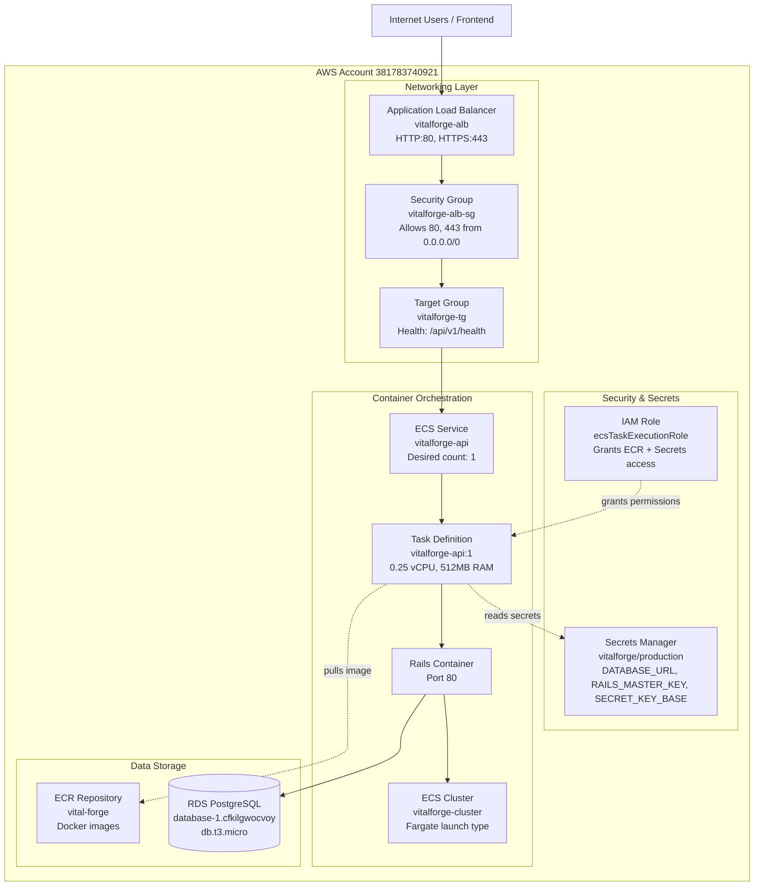
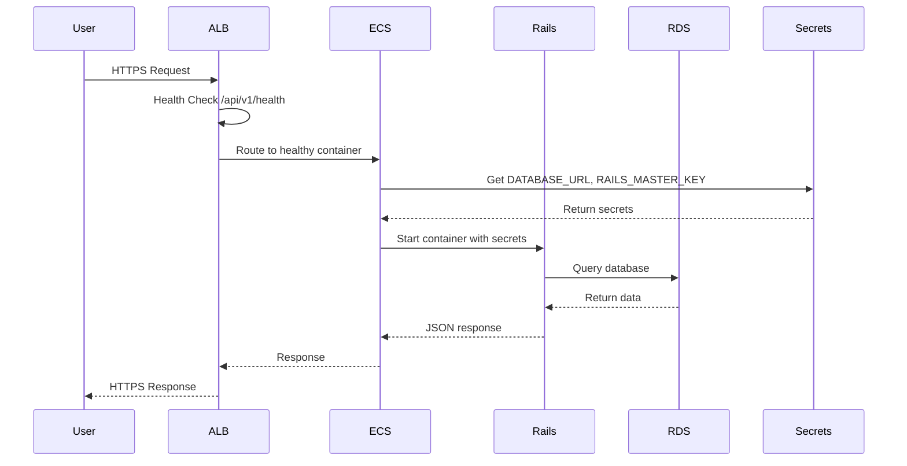

# VitalForge AWS Deployment Architecture

## Overview

VitalForge Rails API is deployed on AWS using a modern containerized architecture with ECS Fargate, RDS PostgreSQL, and Application Load Balancer.

---

## Architecture Diagram



---

## Component Details

### 1. Entry Point - Application Load Balancer (ALB)

| Property | Value |
|----------|-------|
| **Name** | vitalforge-alb |
| **Type** | Application Load Balancer |
| **Scheme** | Internet-facing |
| **Listeners** | HTTP:80 (HTTPS:443 when SSL added) |
| **Target Group** | vitalforge-tg (IP targets) |
| **Health Check** | /api/v1/health |

**Purpose**: Public entry point that distributes traffic to containers and performs health checks.

---

### 2. Container Orchestration - ECS Fargate

| Property | Value |
|----------|-------|
| **Cluster** | vitalforge-cluster |
| **Service** | vitalforge-api |
| **Task Definition** | vitalforge-api:1 |
| **Launch Type** | Fargate (serverless) |
| **CPU** | 0.25 vCPU (256 units) |
| **Memory** | 512 MB |
| **Container Port** | 80 |

**Purpose**: Runs Rails containers without managing servers. Auto-scales and self-heals.

---

### 3. Container Registry - ECR

| Property | Value |
|----------|-------|
| **Repository** | vital-forge |
| **Image URI** | 381783740921.dkr.ecr.us-east-1.amazonaws.com/vital-forge:latest |
| **Base Image** | ruby:3.2.6-slim |

**Purpose**: Stores Docker images. ECS pulls images from here to run containers.

---

### 4. Database - RDS PostgreSQL

| Property | Value |
|----------|-------|
| **Endpoint** | database-1.cfkilgwocvoy.us-east-1.rds.amazonaws.com |
| **Engine** | PostgreSQL 15+ |
| **Instance** | db.t3.micro |
| **Database Name** | vital_forge_production |
| **Storage** | 20 GB gp2 |

**Purpose**: Managed PostgreSQL database for production data.

---

### 5. Secrets Management - AWS Secrets Manager

| Property | Value |
|----------|-------|
| **Secret Name** | vitalforge/production |
| **Contents** | DATABASE_URL, RAILS_MASTER_KEY, SECRET_KEY_BASE |
| **Access** | Via ECS task execution role |

**Purpose**: Securely stores credentials. Injected as environment variables into containers.

---

### 6. Security - IAM & Security Groups

#### IAM Role: ecsTaskExecutionRole
- **Managed Policy**: AmazonECSTaskExecutionRolePolicy (ECR pull, CloudWatch logs)
- **Custom Policy**: SecretsManagerAccess (read vitalforge/production)

#### Security Groups

| Name | Type | Inbound Rules | Purpose |
|------|------|---------------|---------|
| vitalforge-alb-sg | ALB | 80, 443 from 0.0.0.0/0 | Allow public HTTP/HTTPS |
| vitalforge-ecs-sg | ECS Tasks | 80 from ALB SG | Allow ALB → Container |
| vitalforge-rds-sg | RDS | 5432 from ECS SG | Allow Container → Database |

---

## Request Flow



---

## Deployment Process

### Initial Setup (One-Time)

1. **Database**: Create RDS PostgreSQL instance
2. **Secrets**: Store credentials in Secrets Manager
3. **Registry**: Create ECR repository
4. **IAM**: Create task execution role with policies
5. **Networking**: Create VPC, subnets, security groups
6. **Load Balancer**: Create ALB, target group, listeners
7. **ECS**: Create cluster, register task definition

### Continuous Deployment

```bash
# 1. Build new image
docker build -t vital-forge .

# 2. Tag for ECR
docker tag vital-forge:latest 381783740921.dkr.ecr.us-east-1.amazonaws.com/vital-forge:latest

# 3. Push to ECR
docker push 381783740921.dkr.ecr.us-east-1.amazonaws.com/vital-forge:latest

# 4. Update ECS service (forces new deployment)
aws ecs update-service \
  --cluster vitalforge-cluster \
  --service vitalforge-api \
  --force-new-deployment
```

---

## Cost Breakdown (Monthly)

| Service | Specification | Estimated Cost |
|---------|--------------|----------------|
| **ECS Fargate** | 0.25 vCPU, 0.5GB RAM, 24/7 | $9 |
| **RDS PostgreSQL** | db.t3.micro, 20GB storage | $15 |
| **Application Load Balancer** | Base + data transfer | $18 |
| **ECR** | Image storage (~1GB) | $1 |
| **Secrets Manager** | 1 secret | $0.40 |
| **CloudWatch Logs** | Log storage (minimal) | $1 |
| **Data Transfer** | Outbound to internet | $5 |
| **Total** | | **~$49/month** |

### Cost Optimization Options

- **Use NAT Gateway alternative**: Public subnets for Fargate (saves ~$35/mo)
- **RDS Reserved Instance**: 1-year commit (saves ~30%)
- **Fargate Spot**: Use spot pricing (saves ~70% on compute)

---

## Monitoring & Logging

### CloudWatch Logs

| Log Group | Contents |
|-----------|----------|
| `/ecs/vitalforge` | Rails application logs (STDOUT) |
| `/aws/rds/instance/database-1/postgresql` | Database logs |

### Health Checks

- **ALB Health Check**: `GET /api/v1/health` every 30s
- **Expected Response**: 200 OK
- **Unhealthy Threshold**: 2 consecutive failures
- **Healthy Threshold**: 2 consecutive successes

---

## Scaling Configuration

### Current Setup (MVP)
- **Desired Count**: 1 task
- **Min Tasks**: 1
- **Max Tasks**: 1

### Future Auto-Scaling (When Needed)
```
Target Tracking Policy:
- Metric: CPU Utilization
- Target: 70%
- Scale out: Add task when CPU > 70% for 2 min
- Scale in: Remove task when CPU < 70% for 5 min
- Min: 1, Max: 4
```

---

## Disaster Recovery

### Database Backups
- **Automated Backups**: Daily snapshots (7-day retention)
- **Manual Snapshots**: Before major deployments
- **Point-in-Time Recovery**: Available

### Container Recovery
- **ECS Auto-Recovery**: Automatically replaces failed tasks
- **Image Versioning**: Tag images with git SHA for rollback
- **Blue-Green Deployment**: Use separate task definitions for zero-downtime updates

---

## Security Best Practices

✅ **Implemented**:
- Secrets stored in AWS Secrets Manager (not environment variables)
- IAM roles with least-privilege access
- Security groups restrict traffic by source
- Container runs as non-root user
- SSL/TLS for data in transit (when domain added)
- RDS in private subnet (not publicly accessible)

🔄 **To Implement**:
- WAF (Web Application Firewall) for DDoS protection
- CloudTrail for audit logging
- GuardDuty for threat detection
- Secrets rotation policy
- Multi-AZ RDS for high availability

---

## Troubleshooting

### Container Won't Start
```bash
# Check CloudWatch logs
aws logs tail /ecs/vitalforge --follow

# Check task status
aws ecs describe-tasks \
  --cluster vitalforge-cluster \
  --tasks TASK_ID
```

### Health Check Failing
- Verify `/api/v1/health` endpoint exists
- Check security group allows ALB → Container on port 80
- Review Rails logs for errors

### Database Connection Issues
- Verify DATABASE_URL in Secrets Manager
- Check RDS security group allows ECS security group on port 5432
- Confirm RDS is in same VPC as ECS tasks

---

## Related Documentation

- [Frontend API Guide](./FRONTEND_API_GUIDE.md)
- [API Documentation](../documentation/API_DOCUMENTATION.md)
- [Custom Workout Plan](./CUSTOM_WORKOUT_PLAN.md)
- [Documentation Map](./DOCUMENTATION_MAP.md)

---

**Last Updated**: December 21, 2024  
**AWS Region**: us-east-1  
**Account ID**: 381783740921

