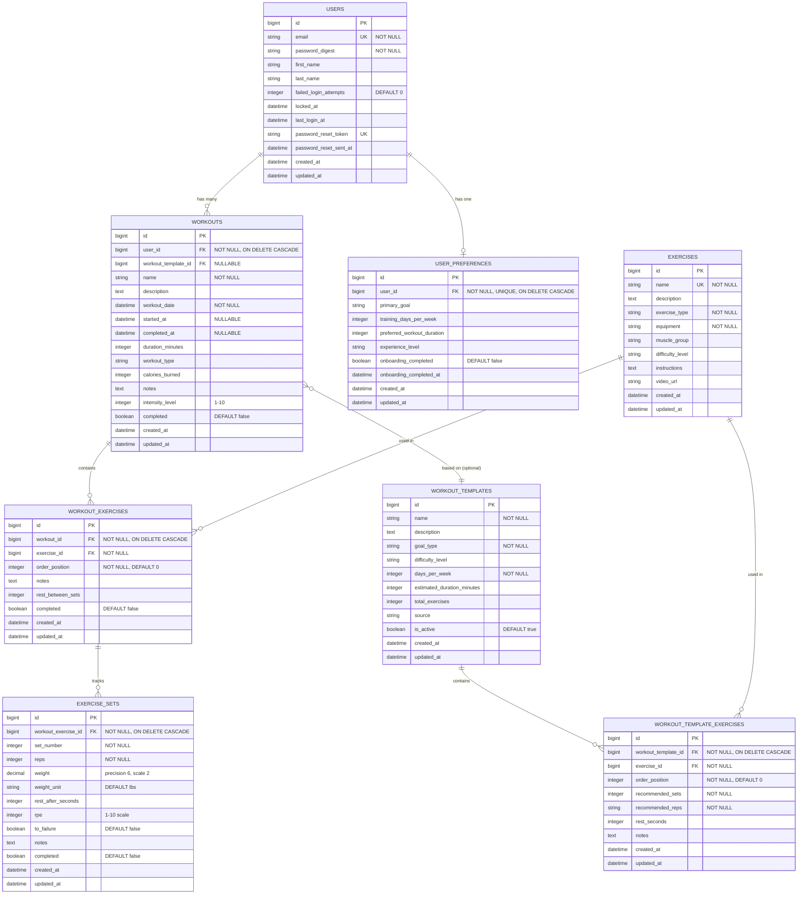

# VitalForge Database Schema

## Overview

VitalForge uses a normalized PostgreSQL database schema optimized for fitness tracking. The schema is designed to track users, their workouts, exercises performed, and individual sets with detailed performance metrics.

## Entity Relationship Diagram (ERD)



## Table Schemas

### 1. Users Table

**Purpose**: Store user accounts and authentication data.

| Column | Type | Constraints | Description |
|--------|------|-------------|-------------|
| id | bigint | PK, AUTO INCREMENT | Primary key |
| email | string(255) | NOT NULL, UNIQUE | User email (normalized to lowercase) |
| password_digest | string(255) | NOT NULL | Bcrypt encrypted password |
| first_name | string(255) | | User's first name |
| last_name | string(255) | | User's last name |
| failed_login_attempts | integer | DEFAULT 0, NOT NULL | Failed login counter for security |
| locked_at | datetime | | Account lockout timestamp |
| last_login_at | datetime | | Last successful login |
| password_reset_token | string(255) | UNIQUE | Secure token for password reset |
| password_reset_sent_at | datetime | | When reset was requested |
| created_at | datetime | NOT NULL | Record creation timestamp |
| updated_at | datetime | NOT NULL | Last update timestamp |

**Indexes:**
- `index_users_on_email` (UNIQUE) - Fast email lookups for authentication
- `index_users_on_password_reset_token` (UNIQUE) - Fast password reset token lookups

**Model Associations:**
- `has_many :workouts, dependent: :destroy`
- `has_one :user_preference, dependent: :destroy`

**Security Features:**
- Account lockout after 5 failed login attempts
- 30-minute lockout duration
- Secure password reset tokens with 2-hour expiration

---

### 2. Workouts Table

**Purpose**: Store individual workout sessions for users.

| Column | Type | Constraints | Description |
|--------|------|-------------|-------------|
| id | bigint | PK, AUTO INCREMENT | Primary key |
| user_id | bigint | FK → users.id, NOT NULL | Workout owner |
| workout_template_id | bigint | FK → workout_templates.id, NULLABLE | Template this workout was created from (null for custom workouts) |
| name | string(255) | NOT NULL | Workout name (e.g., "Morning Leg Day") |
| description | text | | Optional workout description |
| workout_date | datetime | NOT NULL | When workout occurred |
| started_at | datetime | NULLABLE | When user began the workout |
| completed_at | datetime | NULLABLE | When user finished the workout |
| duration_minutes | integer | | Total workout duration (calculated from started_at to completed_at) |
| workout_type | string(255) | | Category: Strength, Cardio, HIIT, Yoga, etc. |
| calories_burned | integer | | Estimated calories burned |
| notes | text | | User's workout notes |
| intensity_level | integer | | Rating 1-10 |
| completed | boolean | DEFAULT false, NOT NULL | Completion status |
| created_at | datetime | NOT NULL | Record creation timestamp |
| updated_at | datetime | NOT NULL | Last update timestamp |

**Indexes:**
- `index_workouts_on_user_id` - Fast lookup of user's workouts (from `t.references`)
- `index_workouts_on_user_and_date` - Composite index for date-range queries
- `index_workouts_on_workout_type` - Filter by workout type
- `index_workouts_on_completed` - Filter by completion status

**Foreign Keys:**
- `user_id` → `users.id` (ON DELETE CASCADE)

**Model Associations:**
- `belongs_to :user`
- `belongs_to :workout_template, optional: true`
- `has_many :workout_exercises, dependent: :destroy`
- `has_many :exercises, through: :workout_exercises`

**Common Queries:**
```ruby
# User's recent workouts
user.workouts.recent

# Workouts in date range
user.workouts.by_date_range(30.days.ago, Date.today)

# Completed strength workouts
user.workouts.completed.by_type("Strength")
```

---

### 3. Workout_Templates Table

**Purpose**: Store reusable workout program templates (e.g., "Push Pull Legs", "5/3/1").

| Column | Type | Constraints | Description |
|--------|------|-------------|-------------|
| id | bigint | PK, AUTO INCREMENT | Primary key |
| name | string(255) | NOT NULL | Template name (e.g., "Push Pull Legs") |
| description | text | | Full description of the program |
| goal_type | string(255) | NOT NULL | "physique" or "strength" |
| difficulty_level | string(255) | | "Beginner", "Intermediate", "Advanced" |
| days_per_week | integer | NOT NULL | 3, 4, 5, or 6 |
| estimated_duration_minutes | integer | | Average workout time |
| total_exercises | integer | | Number of exercises in template |
| source | string(255) | | e.g., "Bodybuilding.com", "T-Nation" |
| is_active | boolean | DEFAULT true, NOT NULL | For soft delete/hiding |
| created_at | datetime | NOT NULL | Record creation timestamp |
| updated_at | datetime | NOT NULL | Last update timestamp |

**Indexes:**
- `index_workout_templates_on_goal_type` - Filter by goal
- `index_workout_templates_on_difficulty_level` - Filter by difficulty
- `index_workout_templates_on_days_per_week` - Filter by training frequency
- `index_workout_templates_on_is_active` - Show only active templates

**Model Associations:**
- `has_many :workout_template_exercises, dependent: :destroy`
- `has_many :exercises, through: :workout_template_exercises`
- `has_many :workouts` - Workouts created from this template

**Design Note:**
Templates are reusable blueprints. When a user "starts" a template, it creates a new `Workout` record with all exercises and empty sets pre-populated.

---

### 4. Workout_Template_Exercises Table (Join Table)

**Purpose**: Links workout templates to exercises with template-specific recommendations.

| Column | Type | Constraints | Description |
|--------|------|-------------|-------------|
| id | bigint | PK, AUTO INCREMENT | Primary key |
| workout_template_id | bigint | FK → workout_templates.id, NOT NULL | Parent template |
| exercise_id | bigint | FK → exercises.id, NOT NULL | Exercise in template |
| order_position | integer | NOT NULL, DEFAULT 0 | Order in template (1st, 2nd, 3rd) |
| recommended_sets | integer | NOT NULL | e.g., 3, 4, 5 |
| recommended_reps | string(255) | NOT NULL | e.g., "8-12", "5", "AMRAP" |
| rest_seconds | integer | | Rest between sets |
| notes | text | | Exercise-specific notes for this template |
| created_at | datetime | NOT NULL | Record creation timestamp |
| updated_at | datetime | NOT NULL | Last update timestamp |

**Indexes:**
- `index_workout_template_exercises_on_workout_template_id` - Fast lookup
- `index_workout_template_exercises_on_exercise_id` - Fast lookup
- Composite on `workout_template_id + order_position` - Ordered queries

**Foreign Keys:**
- `workout_template_id` → `workout_templates.id` (ON DELETE CASCADE)
- `exercise_id` → `exercises.id` (NO CASCADE - preserve exercise catalog)

**Model Associations:**
- `belongs_to :workout_template`
- `belongs_to :exercise`

---

### 5. User_Preferences Table

**Purpose**: Store user onboarding preferences and fitness goals.

| Column | Type | Constraints | Description |
|--------|------|-------------|-------------|
| id | bigint | PK, AUTO INCREMENT | Primary key |
| user_id | bigint | FK → users.id, NOT NULL, UNIQUE | User (one-to-one) |
| primary_goal | string(255) | | "physique" or "strength" |
| training_days_per_week | integer | | 3-6 days |
| preferred_workout_duration | integer | | Minutes |
| experience_level | string(255) | | "Beginner", "Intermediate", "Advanced" |
| onboarding_completed | boolean | DEFAULT false, NOT NULL | Has user completed onboarding? |
| onboarding_completed_at | datetime | | When onboarding was completed |
| created_at | datetime | NOT NULL | Record creation timestamp |
| updated_at | datetime | NOT NULL | Last update timestamp |

**Indexes:**
- `index_user_preferences_on_user_id` (UNIQUE) - One preference per user

**Foreign Keys:**
- `user_id` → `users.id` (ON DELETE CASCADE)

**Model Associations:**
- `belongs_to :user`

**Design Note:**
Used to personalize workout template recommendations based on user's goals and availability.

---

### 6. Exercises Table

**Purpose**: Master catalog of all exercises (reusable across all users).

| Column | Type | Constraints | Description |
|--------|------|-------------|-------------|
| id | bigint | PK, AUTO INCREMENT | Primary key |
| name | string(255) | NOT NULL, UNIQUE | Exercise name (e.g., "Barbell Squat") |
| description | text | | Exercise overview |
| exercise_type | string(255) | NOT NULL | Strength, Cardio, Mobility, Hypertrophy, etc. |
| equipment | string(255) | NOT NULL | Bodyweight, Dumbbells, Barbell, etc. |
| muscle_group | string(255) | | Chest, Back, Legs, Shoulders, Arms, Core, FullBody |
| difficulty_level | string(255) | | Beginner, Intermediate, Advanced |
| instructions | text | | How to perform the exercise |
| video_url | string(255) | | Link to demo video |
| created_at | datetime | NOT NULL | Record creation timestamp |
| updated_at | datetime | NOT NULL | Last update timestamp |

**Indexes:**
- `index_exercises_on_name` (UNIQUE) - Fast lookup by name, prevents duplicates
- `index_exercises_on_exercise_type` - Filter by type
- `index_exercises_on_equipment` - Filter by equipment
- `index_exercises_on_muscle_group` - Filter by muscle group

**Model Associations:**
- `has_many :workout_exercises, dependent: :restrict_with_error`
- `has_many :workouts, through: :workout_exercises`

**Design Note:** 
This is a catalog table, not user-specific. Same "Bench Press" exercise is referenced by all users. Use `dependent: :restrict_with_error` to prevent deletion of exercises that are in use.

**Enum Values:**
```ruby
# exercise_type
%w[Strength Cardio Mobility Hypertrophy Stability Endurance Flexibility]

# equipment
%w[Bodyweight Dumbbells Barbell Kettlebells MedicineBall Cable Machine Bench Bands Other]

# muscle_group
%w[Chest Back Legs Shoulders Arms Core FullBody]

# difficulty_level
%w[Beginner Intermediate Advanced]
```

---

### 7. Workout_Exercises Table (Join Table)

**Purpose**: Links workouts to exercises with workout-specific metadata.

| Column | Type | Constraints | Description |
|--------|------|-------------|-------------|
| id | bigint | PK, AUTO INCREMENT | Primary key |
| workout_id | bigint | FK → workouts.id, NOT NULL | Parent workout |
| exercise_id | bigint | FK → exercises.id, NOT NULL | Exercise performed |
| order_position | integer | NOT NULL, DEFAULT 0 | Order in workout (1st, 2nd, 3rd) |
| notes | text | | Notes specific to this exercise instance |
| rest_between_sets | integer | | Default rest time in seconds |
| completed | boolean | DEFAULT false, NOT NULL | Whether exercise was completed |
| created_at | datetime | NOT NULL | Record creation timestamp |
| updated_at | datetime | NOT NULL | Last update timestamp |

**Indexes:**
- `index_workout_exercises_on_workout_id` - Fast lookup of exercises in workout
- `index_workout_exercises_on_exercise_id` - Fast lookup of where exercise is used
- `index_workout_exercises_on_workout_and_order` - Composite index for ordered queries

**Foreign Keys:**
- `workout_id` → `workouts.id` (ON DELETE CASCADE)
- `exercise_id` → `exercises.id` (NO CASCADE - preserve exercise catalog)

**Model Associations:**
- `belongs_to :workout`
- `belongs_to :exercise`
- `has_many :exercise_sets, dependent: :destroy`

**Why This Table Exists:**
Separates the reusable exercise catalog from workout-specific data. Same exercise can appear multiple times in the same workout with different notes/rest periods.

---

### 8. Exercise_Sets Table

**Purpose**: Store individual set performance data (reps, weight, RPE).

| Column | Type | Constraints | Description |
|--------|------|-------------|-------------|
| id | bigint | PK, AUTO INCREMENT | Primary key |
| workout_exercise_id | bigint | FK → workout_exercises.id, NOT NULL | Parent exercise |
| set_number | integer | NOT NULL | Set number (1, 2, 3, etc.) |
| reps | integer | NOT NULL | Number of repetitions |
| weight | decimal(6,2) | | Weight lifted (e.g., 135.50) |
| weight_unit | string(255) | DEFAULT 'lbs' | 'lbs' or 'kg' |
| rest_after_seconds | integer | | Actual rest taken after this set |
| rpe | integer | | Rate of Perceived Exertion (1-10) |
| to_failure | boolean | DEFAULT false | Did set go to muscular failure? |
| notes | text | | Set-specific notes |
| completed | boolean | DEFAULT false | Was this set completed? |
| created_at | datetime | NOT NULL | Record creation timestamp |
| updated_at | datetime | NOT NULL | Last update timestamp |

**Indexes:**
- `index_exercise_sets_on_workout_exercise_id` - Fast lookup of sets for exercise
- `index_exercise_sets_on_workout_exercise_and_number` - Composite index for ordered sets
- `unique_set_number_per_exercise` (UNIQUE) - Prevents duplicate set numbers

**Foreign Keys:**
- `workout_exercise_id` → `workout_exercises.id` (ON DELETE CASCADE)

**Model Associations:**
- `belongs_to :workout_exercise`

**Validations:**
- `set_number`: unique per workout_exercise, must be > 0
- `reps`: must be > 0
- `weight`: must be >= 0 (or nil for bodyweight)
- `weight_unit`: must be 'lbs' or 'kg'
- `rpe`: must be 1-10 (or nil)

**Helper Methods:**
```ruby
set.volume           # reps × weight
set.one_rep_max      # Estimated 1RM using Brzycki formula
set.display_set      # "Set 1: 135 lbs × 10 reps"
```

## Data Relationships

### Hierarchical Structure

```
User
 ├─ UserPreference (primary_goal: "physique", training_days: 5)
 │
 └─ Workout ("Morning Leg Day", 2025-01-15)
     ├─ [Optional] WorkoutTemplate (Push Pull Legs)
     ├─ started_at: 2025-01-15 08:00:00
     ├─ completed_at: 2025-01-15 08:47:00
     │
     ├─ WorkoutExercise #1 (Barbell Squat, order: 1, completed: true)
     │   ├─ ExerciseSet #1: 135 lbs × 10 reps, RPE: 6, completed: true
     │   ├─ ExerciseSet #2: 185 lbs × 8 reps, RPE: 7, completed: true
     │   └─ ExerciseSet #3: 225 lbs × 6 reps, RPE: 9, completed: true
     │
     ├─ WorkoutExercise #2 (Leg Press, order: 2, completed: true)
     │   ├─ ExerciseSet #1: 180 lbs × 12 reps, completed: true
     │   └─ ExerciseSet #2: 270 lbs × 10 reps, completed: true
     │
     └─ WorkoutExercise #3 (Walking Lunges, order: 3, completed: true)
         └─ ExerciseSet #1: bodyweight × 20 reps, completed: true

WorkoutTemplate (Push Pull Legs - shared across all users)
 └─ WorkoutTemplateExercise #1 (Barbell Bench Press)
     ├─ recommended_sets: 4
     ├─ recommended_reps: "8-12"
     └─ rest_seconds: 90
```

### Cascade Behavior

**ON DELETE CASCADE:**
- Delete User → Deletes all Workouts
- Delete Workout → Deletes all WorkoutExercises
- Delete WorkoutExercise → Deletes all ExerciseSets

**RESTRICT:**
- Delete Exercise → Blocked if used in any WorkoutExercise (preserves history)

## Indexing Strategy

### Why These Indexes Exist

1. **Single-column indexes on foreign keys**
   - Fast JOIN operations
   - Efficient relationship queries

2. **Composite indexes**
   - `[user_id, workout_date]` - Most common query pattern: "User's workouts in date range"
   - `[workout_exercise_id, set_number]` - Ordered set retrieval

3. **Unique indexes**
   - `email` - Prevent duplicate accounts, fast authentication
   - `[workout_exercise_id, set_number]` - Prevent duplicate set numbers

4. **Filter indexes**
   - `workout_type` - Dashboard filtering
   - `completed` - Show pending workouts
   - `exercise_type` - Exercise library filtering

### Performance Impact

| Query Type | Without Index | With Index | Speedup |
|------------|---------------|------------|---------|
| User login (email lookup) | 50ms | 1ms | 50x |
| User's workouts (user_id) | 500ms | 2ms | 250x |
| Workouts last 30 days | 800ms | 3ms | 267x |
| Exercise sets (ordered) | 100ms | 1ms | 100x |

## Common Query Patterns

### User Authentication
```ruby
User.find_by(email: 'user@example.com')
# Uses: index_users_on_email (UNIQUE)
```

### Dashboard: Recent Workouts
```ruby
current_user.workouts.recent.limit(10)
# Uses: index_workouts_on_user_id
# Default scope applies: ORDER BY workout_date DESC
```

### Workout Detail View
```ruby
workout.workout_exercises.includes(:exercise, :exercise_sets)
# Uses: index_workout_exercises_on_workout_id
# Eager loads to prevent N+1 queries
```

### Progress Tracking
```ruby
Exercise.find_by(name: "Barbell Squat")
  .workout_exercises
  .joins(:workout)
  .where(workouts: { user_id: current_user.id })
  .includes(:exercise_sets)
  .order('workouts.workout_date DESC')
# Tracks user's progress on specific exercise over time
```

### Analytics: Total Volume
```ruby
workout.workout_exercises.each do |we|
  we.exercise_sets.sum { |set| set.reps * (set.weight || 0) }
end
# Calculates total volume (reps × weight) for workout
```

## Database Constraints

### Data Integrity Rules

1. **NOT NULL constraints** - Required fields enforced at DB level
2. **UNIQUE constraints** - Prevent duplicates (email, exercise name)
3. **Foreign key constraints** - Prevent orphaned records
4. **CHECK constraints** (future) - Validate ranges (e.g., rpe 1-10)
5. **Default values** - Sensible defaults (completed: false)

### Application vs Database Validation

| Validation | Model (Rails) | Database (PostgreSQL) |
|------------|---------------|----------------------|
| Presence | validates :name, presence: true | NOT NULL |
| Uniqueness | validates :email, uniqueness: true | UNIQUE index |
| Format | validates :email, format: {with: regex} | ❌ |
| Associations | validates :user, presence: true | Foreign key constraint |
| Custom logic | validate :custom_method | ❌ |

**Best Practice**: Use both layers for critical validations!

## Migration History

| Migration | Date | Purpose |
|-----------|------|---------|
| 20251026180606 | 2025-10-26 | Create users table with authentication |
| 20251028113158 | 2025-10-28 | Create workouts table |
| 20251028122841 | 2025-10-28 | Create exercises catalog table |
| 20251028123020 | 2025-10-28 | Create workout_exercises join table |
| 20251028123133 | 2025-10-28 | Create exercise_sets table |
| 20251114XXXXXX | 2025-11-14 | Create workout_templates table |
| 20251114XXXXXX | 2025-11-14 | Create workout_template_exercises join table |
| 20251114XXXXXX | 2025-11-14 | Create user_preferences table |
| PENDING | TBD | Add workout_template_id, started_at, completed_at to workouts |
| PENDING | TBD | Change exercise_sets.completed default from true to false |

## Scaling Considerations

### Current Design (0-100K users)
- ✅ Properly indexed foreign keys
- ✅ Composite indexes for common queries
- ✅ Normalized schema prevents data duplication
- ✅ Cascade deletes prevent orphaned records

### Future Optimizations (100K+ users)
- Add partial indexes for frequently filtered subsets
- Consider table partitioning for exercise_sets (by date)
- Add counter caches (e.g., workout.exercise_sets_count)
- Implement database views for complex analytics
- Add materialized views for dashboard metrics

### Monitoring Queries to Add

```sql
-- Find missing indexes
SELECT schemaname, tablename, attname, n_distinct, correlation
FROM pg_stats
WHERE schemaname = 'public'
ORDER BY abs(correlation) DESC;

-- Find slow queries
SELECT query, calls, total_time, mean_time
FROM pg_stat_statements
WHERE mean_time > 100
ORDER BY mean_time DESC;

-- Check index usage
SELECT schemaname, tablename, indexname, idx_scan
FROM pg_stat_user_indexes
WHERE schemaname = 'public'
ORDER BY idx_scan ASC;
```

## Sample Data Flow

### Creating a Complete Workout

```ruby
# 1. User logs in
user = User.find_by(email: 'john@example.com')

# 2. Create workout
workout = user.workouts.create!(
  name: "Monday Push Day",
  workout_date: Time.current,
  workout_type: "Strength"
)

# 3. Add exercise from catalog
bench_press = Exercise.find_by(name: "Barbell Bench Press")
workout_exercise = workout.workout_exercises.create!(
  exercise: bench_press,
  order_position: 1,
  rest_between_sets: 90
)

# 4. Log sets
workout_exercise.exercise_sets.create!([
  { set_number: 1, reps: 10, weight: 135, rpe: 6 },
  { set_number: 2, reps: 8,  weight: 185, rpe: 7 },
  { set_number: 3, reps: 6,  weight: 205, rpe: 9 }
])

# 5. Mark as complete
workout_exercise.update!(completed: true)
workout.update!(completed: true)
```

## Backup and Recovery

### Critical Tables Priority
1. **users** - User accounts (highest priority)
2. **workouts** - Workout history
3. **workout_exercises** - Exercise details
4. **exercise_sets** - Performance data
5. **exercises** - Can be recreated from seed data

### Recommended Backup Strategy
```bash
# Daily backups (automated)
pg_dump -Fc vitalforge_production > backup_$(date +%Y%m%d).dump

# Keep last 30 days
# Point-in-time recovery enabled (WAL archiving)
```

## Entity Relationship Summary

```
┌─────────────────┐
│     USERS       │  Authentication & user management
│   (accounts)    │
└────┬────────┬───┘
     │ 1:N    │ 1:1
     │        │
     │   ┌────▼──────────────┐
     │   │ USER_PREFERENCES  │  Onboarding & fitness goals
     │   │  (personalization)│
     │   └───────────────────┘
     │
┌────▼────────┐
│  WORKOUTS   │  Individual workout sessions
│ (sessions)  │
└─┬───────┬───┘
  │ 1:N   │ N:1 (optional)
  │       │
  │   ┌───▼──────────────────┐
  │   │ WORKOUT_TEMPLATES    │  Reusable workout blueprints
  │   │   (blueprints)       │  (shared across users)
  │   └───┬──────────────────┘
  │       │ 1:N
  │       │
  │   ┌───▼─────────────────────────┐
  │   │ WORKOUT_TEMPLATE_EXERCISES  │
  │   │      (template join)        │
  │   └───┬─────────────────────────┘
  │       │ N:1
  │       │
┌─▼───────▼─────────┐       ┌──────────────────┐
│ WORKOUT_EXERCISES │◄─────┤    EXERCISES     │  Exercise catalog
│   (join table)    │ N:1   │   (reusable)     │  (shared across users)
└────────┬──────────┘       └──────────────────┘
         │ 1:N
         │
┌────────▼────────┐
│ EXERCISE_SETS   │  Individual set performance
│  (performance)  │  (reps, weight, RPE)
└─────────────────┘
```

## Further Reading

- [MIGRATIONS_GUIDE.md](./MIGRATIONS_GUIDE.md) - How to write migrations
- [API_DOCUMENTATION.md](./API_DOCUMENTATION.md) - API endpoint documentation
- [DEVELOPMENT.md](./DEVELOPMENT.md) - Development workflow
- [Rails ActiveRecord Guides](https://guides.rubyonrails.org/active_record_basics.html)

---

**Last Updated:** 2025-10-28  
**Schema Version:** 1.0  
**Rails Version:** 8.0.2  
**PostgreSQL Version:** 14+

