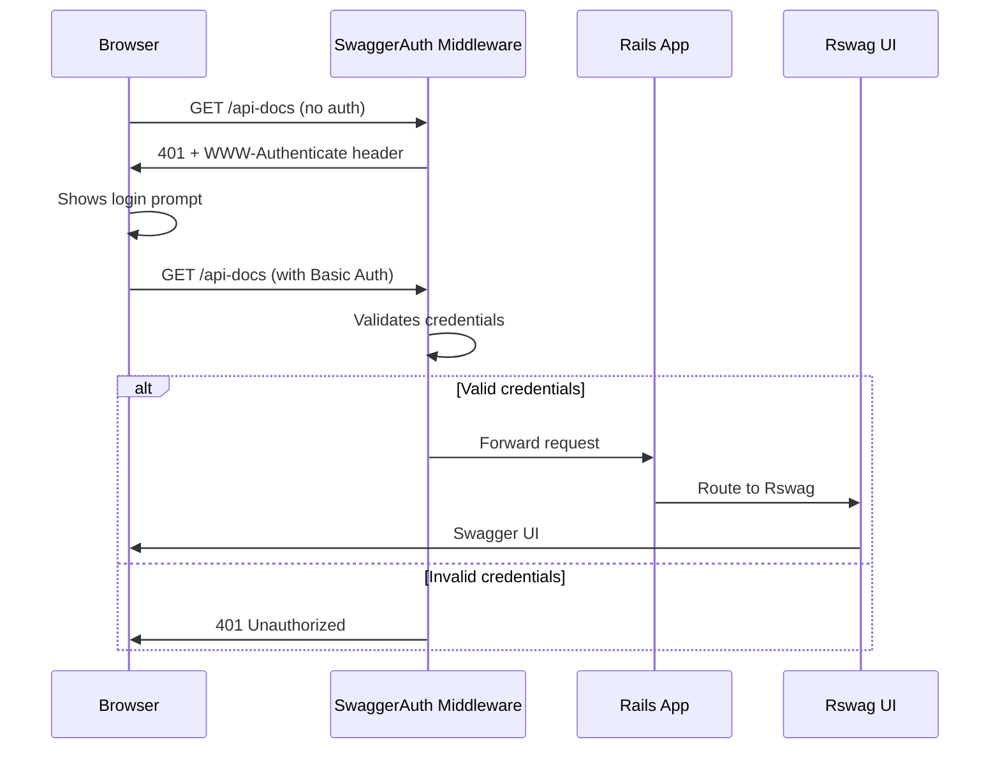

# Swagger API Documentation Setup

## Overview

The Swagger/OpenAPI documentation UI is available at `/api-docs` and is protected by HTTP Basic Authentication. The raw OpenAPI spec is available at `/openapi/v1/swagger.yaml`.

## Security

- **Authentication**: Both endpoints require HTTP Basic Auth credentials
- **Enable/Disable**: Swagger is only available when `SWAGGER_ENABLED=true`
- **Credentials**: Username and password are set via environment variables (not committed to git)

## Environment Variables

Set these in Railway (Service → Variables) for production:

```bash
SWAGGER_ENABLED=true
SWAGGER_BASIC_AUTH_USERNAME=<choose-username>
SWAGGER_BASIC_AUTH_PASSWORD=<choose-strong-password>
```

**Important**: Use a strong, randomly generated password (24+ characters recommended) since Basic Auth is only as secure as the password itself.

## Accessing Swagger Documentation

1. Navigate to `https://api.forge-fitness-journal.app/api-docs`
2. Your browser will prompt for username and password
3. Enter the credentials (shared securely via password manager)
4. The Swagger UI will load and display all API endpoints

The UI will automatically fetch the OpenAPI spec from `/openapi/v1/swagger.yaml` using the same credentials.

## Sharing Credentials with Collaborators

### Best Practices

- ✅ **DO**: Share via encrypted password manager (1Password, Bitwarden, LastPass)
- ✅ **DO**: Share via secure messaging (Signal, encrypted email)
- ❌ **DON'T**: Put credentials in PR comments, screenshots, or documentation
- ❌ **DON'T**: Commit credentials to the repository
- ❌ **DON'T**: Share credentials via plain text messages or unencrypted channels

### Credential Rotation

To change the password:

1. Update `SWAGGER_BASIC_AUTH_PASSWORD` in Railway variables
2. Redeploy or restart the service
3. Share the new credentials with collaborators via secure channel

## Local Development

For local testing, add to your `.env` file (already in `.gitignore`):

```bash
SWAGGER_ENABLED=true
SWAGGER_BASIC_AUTH_USERNAME=admin
SWAGGER_BASIC_AUTH_PASSWORD=test_password_123
```

Then access Swagger at `http://localhost:3000/api-docs`.

## Disabling Swagger

To completely disable Swagger (e.g., in production if you want to hide it):

1. Set `SWAGGER_ENABLED=false` in Railway variables, OR
2. Remove the `SWAGGER_ENABLED` variable entirely
3. The routes will return 404 for `/api-docs` and `/openapi/*`

## Technical Implementation

### Authentication Flow



### Components

1. **`lib/middleware/swagger_auth.rb`**: Rack middleware that intercepts requests to Swagger routes and enforces Basic Auth
2. **`lib/constraints/swagger_basic_auth.rb`**: Route constraint for validating credentials (uses `secure_compare` to prevent timing attacks)
3. **`config/routes.rb`**: Only mounts Swagger routes when `SWAGGER_ENABLED=true`
4. **`config/initializers/rswag_ui.rb`**: Secondary auth layer (Rswag's built-in basic auth)

### Security Features

- **Timing attack prevention**: Uses `ActiveSupport::SecurityUtils.secure_compare` for credential comparison
- **TLS encryption**: HTTPS protects credentials in transit
- **WWW-Authenticate header**: Triggers browser's built-in auth prompt
- **Defense in depth**: Two layers of auth (middleware + Rswag built-in)
- **Environment-based**: No hardcoded credentials

## Troubleshooting

### "401 Unauthorized" error

- Check that `SWAGGER_ENABLED=true` is set
- Verify the username and password match the Railway variables exactly
- Clear browser cache/credentials and try again

### "404 Not Found" error

- Check that `SWAGGER_ENABLED=true` is set in Railway
- Verify the service has been redeployed after adding the variable
- Check Railway logs for any startup errors

### Swagger UI loads but can't fetch spec

- The UI automatically uses the same credentials for `/openapi/v1/swagger.yaml`
- Check browser console for CORS or authentication errors
- Verify the `swagger/v1/swagger.yaml` file exists in the repository

## Related Security Considerations

The `/sidekiq` web UI is currently not protected. Consider applying similar Basic Auth protection to it as well.
